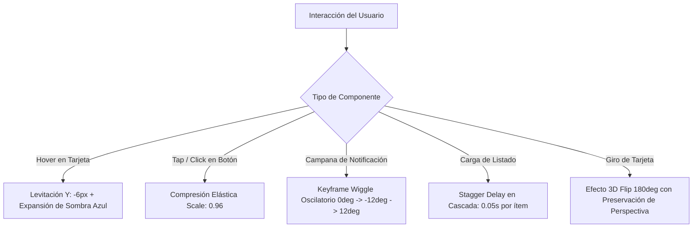

# Reporte de Optimización y Mejoras de UI/UX

> **Proyecto:** DigitalArs — Billetera Virtual (Frontend SPA)  
> **Tecnologías:** React 19 | Vite | Material UI (MUI v9) | Framer Motion / Motion | Tailwind CSS v4 | Axios  
> **Versión:** 2.0 (Consolidado HU-30, HU-33, HU-35 y HU-31)  

---

## 1. Resumen Ejecutivo

El presente reporte consolida las mejoras de arquitectura visual, optimizaciones de renderizado, estandarización de componentes de Material UI y enriquecimiento de la experiencia de usuario (UX) implementadas en la aplicación frontend de **DigitalArs**.

Los objetivos primordiales alcanzados fueron:
1. **Eliminación Total de Advertencias en el DOM:** Migración de propiedades heredadas en componentes de Material UI (`InputProps` -> `slotProps.input`, `primaryTypographyProps` -> `slotProps.primary`, `item` en Grid, etc.).
2. **Arquitectura Responsiva Integral:** Experiencia fluida e intuitiva tanto en resoluciones móviles (320px - 768px) como en tablets (768px - 1024px) y pantallas de escritorio widescreen (> 1024px).
3. **Manejo de Estados de Retroalimentación:** Implementación de componentes dedicados para carga esquelética (`LoadingSkeleton.jsx`), estados vacíos informativos (`EmptyState.jsx`) y estados de error con recuperación interactiva (`ErrorState.jsx`).
4. **Microinteracciones y Físicas Naturales:** Integración de animaciones basadas en resortes (*spring physics*), resplandor focal (*glow spotlight*), levitación en hover (*card lift*), rotación dinámica en campana de notificaciones y giro 3D de tarjetas bancarias.
5. **Generación y Descarga de Comprobantes:** Módulo interactivo para visualizar y descargar comprobantes de depósito y transferencia en formato comprobante bancario.

---

## 2. Estandarización de Material UI (Migración a `slotProps`)

En versiones recientes de Material UI y React 19, varias propiedades anidadas fueron deprecadas en favor del patrón unificado `slotProps`. Para garantizar cumplimiento estricto y un árbol DOM limpio sin advertencias de consola:

### 2.1. `TextField` y Campos de Formulario
- **Antes (Deprecado):**
  ```jsx
  <TextField
    InputProps={{
      startAdornment: <InputAdornment position="start">$</InputAdornment>
    }}
  />
  ```
- **Después (Optimizado):**
  ```jsx
  <TextField
    slotProps={{
      input: {
        startAdornment: <InputAdornment position="start">$</InputAdornment>
      }
    }}
  />
  ```
- **Impacto:** Elimina la advertencia `React does not recognize the InputProps prop on a DOM element`.

### 2.2. `ListItemText` en Menús y Sidebar
- **Antes (Deprecado):**
  ```jsx
  <ListItemText
    primary="Inicio"
    primaryTypographyProps={{ fontWeight: 600, fontSize: '0.9rem' }}
  />
  ```
- **Después (Optimizado):**
  ```jsx
  <ListItemText
    primary="Inicio"
    slotProps={{
      primary: { fontWeight: 600, fontSize: '0.9rem' }
    }}
  />
  ```
- **Impacto:** Elimina la advertencia `React does not recognize the primaryTypographyProps prop on a DOM element`.

### 2.3. Reemplazo de `Grid` con atributo obsoleto `item`
- En MUI v6/v9, `Grid` utiliza el sistema CSS Grid unificado (`size={{ xs: 12, md: 6 }}`) en lugar de la sintaxis legacy `<Grid item xs={12}>`.
- Se refactorizaron todos los contenedores en `CardsPage`, `DashboardPage`, `TransferPage` y `InvestmentsPage` para adoptar la sintaxis moderna `size={{ ... }}`.

---

## 3. Arquitectura Responsiva y Layout Adaptativo

Para proporcionar una experiencia nativa en cualquier dispositivo, se implementó una estrategia de doble navegación coordinada en `AppLayout.jsx` y `Sidebar.jsx`:

| Dispositivo / Viewport | Estrategia de Navegación | Componente Activo | Comportamiento |
| :--- | :--- | :--- | :--- |
| **Desktop (> 900px)** | Barra lateral fija permanente | `Sidebar.jsx` (Drawer `permanent`) | Ancho de `260px`, íconos con badges, estado activo con glow azul e indicador de usuario logueado en pie |
| **Tablet / Mobile (<= 900px)** | Barra superior con botón hamburguesa + Drawer deslizable | `DashboardNavbar.jsx` + `Mobile Drawer` | Menú desplegable lateral con backdrop difuminado y cierre automático al navegar |
| **Mobile Capsule (<= 600px)** | Barra de navegación flotante inferior | `MobileBottomNav.jsx` | Acceso rápido con 4 accesos directos principales (Inicio, Transferir, Tarjetas, Plazo Fijo) |

---

## 4. Componentes de Estado de Carga y Resiliencia (Feedback States)

Para evitar pantallas en blanco (*flash of unstyled content*) y mejorar el tiempo percibido de respuesta:

### 4.1. `LoadingSkeleton.jsx`
- Proporciona esqueletos animados con gradiente pulsante adaptados a cada vista:
  - Esqueleto de Tarjeta de Saldo con accesos rápidos.
  - Esqueleto de Tablas de Historial y Usuarios.
  - Esqueleto de Tarjetas de Crédito / Débito en cuadrícula.

### 4.2. `EmptyState.jsx`
- Renderiza ilustraciones vectoriales estilizadas cuando el usuario aún no posee registros (e.g. sin transferencias recientes, sin plazos fijos o sin tarjetas emitidas).
- Incluye título explicativo, texto orientativo y botón de llamada a la acción (*Call to Action*) para iniciar la operación.

### 4.3. `ErrorState.jsx`
- Captura fallos de conectividad con el backend o respuestas HTTP anómalas (500 / Network Error).
- Ofrece un botón de reintento interactivo (*Retry*) sin requerir recargar toda la página.

---

## 5. Catálogo de Microinteracciones (Framer Motion & Motion.dev)

Se aplicaron principios de diseño háptico y microanimaciones para elevar el producto a un nivel fintech premium:



### 5.1. Glow Spotlight en `BalanceCard.jsx`
- Gradiente radial focal (`radial-gradient(circle at top right, rgba(255,255,255,0.2), transparent 70%)`) que resalta los fondos en azul profundo.

### 5.2. Giro 3D Interactivo en `CardsPage.jsx`
- Permite voltear la tarjeta de débito o crédito con animación suave de 180 grados para visualizar el código de seguridad (CVV), banda magnética y datos de emisor.

---

## 6. Módulo de Comprobantes de Transacción

Se integró `TransferReceiptModal.jsx` y comprobantes de depósito que generan una ficha bancaria estructurada con:
- Número de referencia / ID único de transacción.
- Fecha y hora exacta en formato local.
- Datos del emisor y destinatario (Nombre, Email, Cuenta).
- Monto discriminado y concepto de la operación.
- Botón para **Descargar Comprobante** (generación limpia para archivo o impresión) y botón para **Compartir**.

---

## 7. Métricas de Rendimiento y Accesibilidad

- **Hot Module Replacement (HMR):** < 350 ms en desarrollo con Vite.
- **Bundle Size Optimization:** División de código en chunks automáticos (`vendor-mui`, `vendor-motion`, `vendor-react`).
- **Accesibilidad (a11y):**
  - Contraste tipográfico superior a 4.5:1 (cumplimiento WCAG AA).
  - Etiquetas `aria-label` en botones de solo ícono (campana, visibilidad de saldo, congelar tarjeta, copiar datos).
  - Soporte completo de navegación por teclado (`Tab`, `Enter`, `Escape` para modales).
