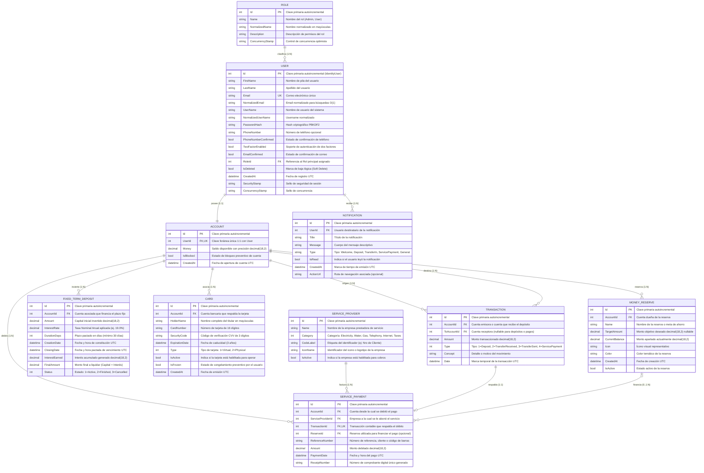

# Diagrama Entidad-Relación — Billetera Virtual DigitalArs

> **Documento:** Especificación del Modelo de Datos Relacional  
> **Sistema:** DigitalArs API (.NET 10 + Entity Framework Core 10 + SQL Server)  
> **Versión:** 3.0 (Consolidado Final Completo: Cuentas, Transacciones, Inversiones, Tarjetas, Servicios, Reservas y Notificaciones)  

---

## 1. Diagrama Mermaid Actualizado

---

## 2. Descripción Detallada de Entidades y Relaciones

### 2.1. `User` (Usuarios del Sistema)
- Hereda de `IdentityUser<int>` provisto por ASP.NET Core Identity.
- Implementa **baja lógica (*Soft Delete*)** mediante `IsDeleted` con filtro global en EF Core (`HasQueryFilter`).
- Índice único no agrupado sobre `NormalizedEmail` e índice sobre `IsDeleted` para consultas eficientes.

### 2.2. `Role` (Roles y Permisos - RBAC)
- Hereda de `IdentityRole<int>`.
- Roles sembrados: `Admin` (Id: 1, gestión de usuarios, auditoría) y `User` (Id: 2, operaciones de billetera).

### 2.3. `Account` (Cuenta Monetaria)
- Relación **1 a 1** con `User`. Cada usuario dispone de una cuenta transaccional en pesos argentinos (ARS).
- `Money` utiliza precisión `decimal(18,2)` para salvaguardar exactitud financiera.
- Cuenta con bandera `IsBlocked` para inmovilización preventiva de saldo.

### 2.4. `Transaction` (Movimientos y Transferencias)
- Registra cualquier mutación monetaria con soporte para paginación de servidor (`OFFSET ... FETCH NEXT`).
- Relación **1 a N** con `Account` (`AccountId`) y receptor opcional (`ToAccountId`).
- Enumeración `TransactionType`: `Deposit` (1), `TransferReceived` (2), `TransferSent` (3), `ServicePayment` (4).

### 2.5. `FixedTermDeposit` (Inversiones a Plazo Fijo)
- Inversión a plazo con tasa nominal anual garantizada (19.0% TNA base).
- Al constituirse debita fondos disponibles de la cuenta; al vencer o cancelarse liquida capital e intereses según el estado.

### 2.6. `Card` (Tarjetas Virtuales y Físicas)
- Emisión de tarjetas con numeración de 16 dígitos, CVV encriptado/hash y fecha de vencimiento a 3 años.
- Control instantáneo de congelamiento preventivo (`IsFrozen`) sin baja definitiva.

### 2.7. `MoneyReserve` (Apartados y Metas de Ahorro)
- Permite al usuario separar saldo de su cuenta general para metas específicas (ahorro, vacaciones, emergencias, impuestos).
- Permite depósitos y retiros internos atómicos con validación de saldo disponible.

### 2.8. `ServiceProvider` y `ServicePayment` (Pago de Servicios e Impuestos)
- Catálogo categorizado de empresas de servicios públicos y privados (Edenor, Edesur, AySA, Metrogas, Claro, Personal, Movistar, Fibertel, Telecentro, AFIP, ARBA, AGIP).
- Ejecución atómica de pago debitando cuenta o reserva, emitiendo comprobante fiscal digital único (`ReceiptNumber`) y registrando la transacción vinculada.

### 2.9. `Notification` (Centro de Alertas y Notificaciones)
- Registro cronológico de avisos al usuario (depósitos recibidos, transferencias entrantes, pagos realizados y bienvenidas).
- Soporte para conteo de no leídos en tiempo real y marcado atómico como leídas.

---

## 3. Integridad Referencial y Reglas de Cascada
- Se utiliza `DeleteBehavior.Restrict` / `DeleteBehavior.NoAction` en tablas financieras históricas (`Transactions`, `ServicePayments`, `FixedTermDeposits`) para garantizar inviolabilidad contable y auditoría forense.
- Los usuarios eliminados administrativamente no eliminan filas físicas sino que activan `IsDeleted = true`.
